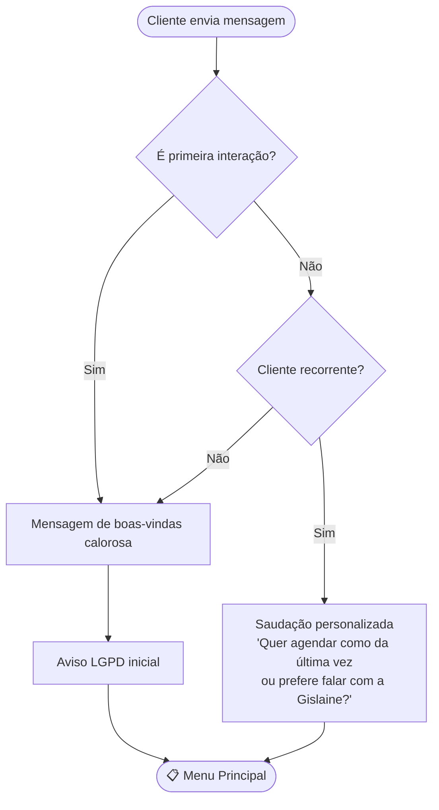
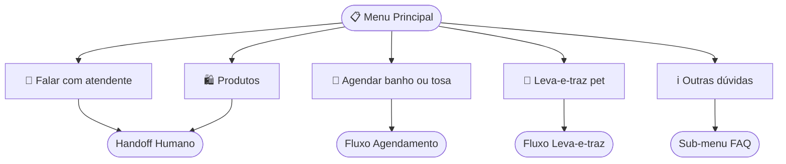
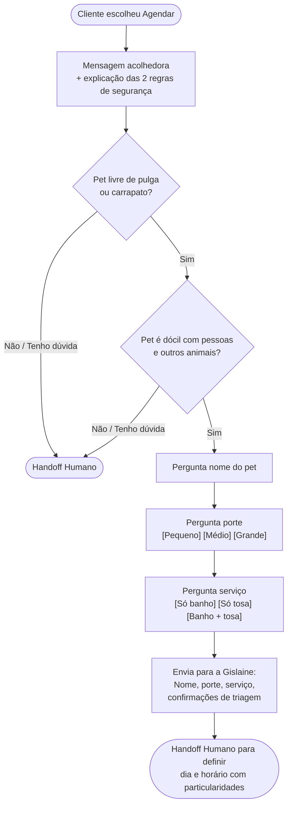
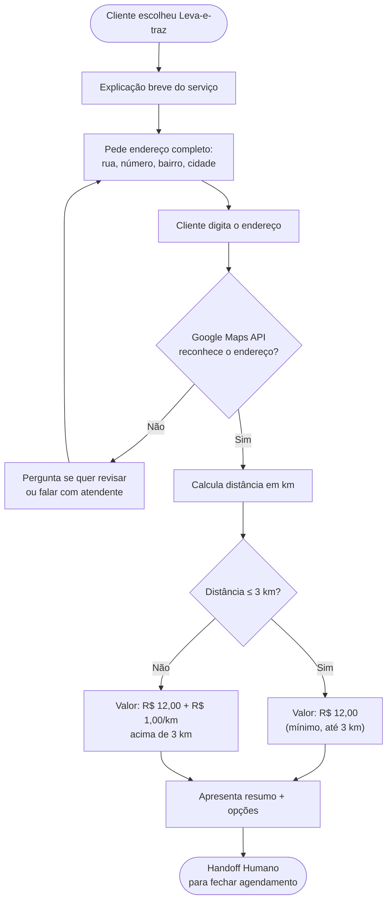
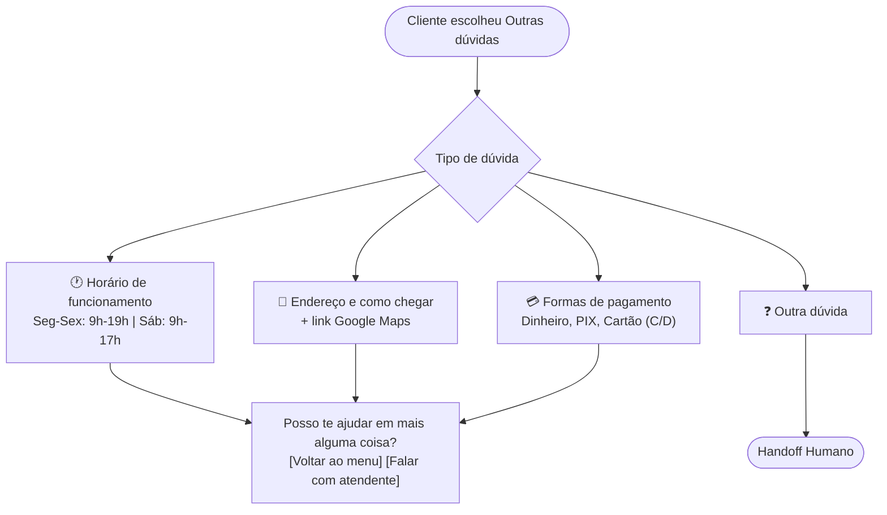
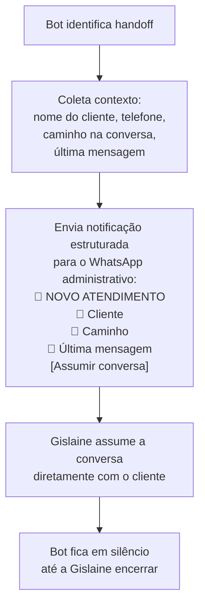

# Fluxograma do Chatbot Pet Friends

> Fluxos conversacionais do chatbot, validados com a proprietária Gislaine M. dos Santos em 15/06/2026.
> Os diagramas abaixo usam **Mermaid** e são renderizados automaticamente pelo GitHub.

---

## 1. Visão geral — entrada do cliente



---

## 2. Menu Principal

O menu utiliza **List Message** do WhatsApp Cloud API, com 5 opções clicáveis. Por decisão da proprietária (15/06/2026), **"Falar com atendente" é a primeira opção** para garantir acesso humano imediato, especialmente para clientes idosos.



---

## 3. Fluxo: Agendar banho ou tosa

Coleta apenas dados básicos do pet e do serviço. **Toda a marcação de dia e horário é feita pela proprietária** pessoalmente, para considerar particularidades de cada pet (ex.: temperamento, tempo de tosa).



---

## 4. Fluxo: Leva-e-traz pet

Coleta o endereço completo do cliente e calcula automaticamente a distância e o valor usando a Google Maps Distance Matrix API.

**Fórmula:** R$ 12,00 fixos até 3 km da loja, mais R$ 1,00 por km adicional.



---

## 5. Fluxo: Sub-menu de dúvidas (FAQ)



---

## 6. Handoff Humano — caminhos múltiplos (acessibilidade)

Decisão da proprietária (15/06/2026): garantir muitos caminhos para o cliente — especialmente o idoso — chegar à equipe humana sem fricção.

```mermaid
flowchart TD
    A([Cliente envia algo]) --> B{Tipo de mensagem}
    B -- Áudio --> H([🔔 Handoff Humano])
    B -- Imagem --> H
    B -- Sticker / mídia --> H
    B -- Texto --> C{Detecção de intenção}
    C -- "atendente, humano, pessoa,<br>ajuda, socorro, não entendi" --> H
    C -- Botão "Falar com atendente" --> H
    C -- Mensagem fora do fluxo --> H
    C -- Cliente inativo > 2 min --> D["'Quer falar com a equipe?'<br>[Sim] [Continuo aqui]"]
    D -- Sim --> H
    C -- Outras --> E[Continua fluxo normal do bot]
    H --> F["Bot informa o cliente:<br>'Vou te conectar com a Gislaine agora'<br>Gislaine recebe notificação com contexto"]
```

---

## 7. Notificação que a Gislaine recebe

Em todos os casos de handoff, a proprietária recebe uma mensagem estruturada no WhatsApp administrativo, com o contexto da conversa, para assumir sem precisar reler.



---

## Princípios de design aplicados

1. **Boas-vindas calorosas primeiro.** Nenhuma pergunta intrusiva no primeiro contato.
2. **Triagem apenas quando faz sentido.** Só clientes que querem agendar banho/tosa veem perguntas — e em formato colaborativo.
3. **Múltiplas portas para atendente humano.** Botão prioritário, palavras-chave, áudio, imagem, inatividade.
4. **Botões clicáveis em vez de texto digitado.** Mais acessível para idosos.
5. **Linguagem simples e frases curtas.** Sem jargão.
6. **Sem preços fixos no chatbot.** Valores variam por porte e pelagem (decisão da proprietária).
7. **Agendamento totalmente humano.** Bot coleta até o tipo de serviço; dia e horário são marcados pela Gislaine.
8. **Leva-e-traz com cálculo automático.** Distância real via Google Maps, fórmula da loja (R$ 12 + R$ 1/km).

---

## Status do design

| Etapa | Status | Data |
|---|---|---|
| Levantamento inicial de requisitos | ✅ Concluído | 28/05/2026 |
| Validação com a proprietária | ✅ Concluído | 15/06/2026 |
| Definição final dos fluxos | ✅ Concluído | 30/06/2026 |
| Aprovação do planejamento pelo professor-tutor | ✅ Concluído | 25/06/2026 |
| Início do desenvolvimento (Etapa 3) | ⏳ A iniciar | Julho/2026 |
